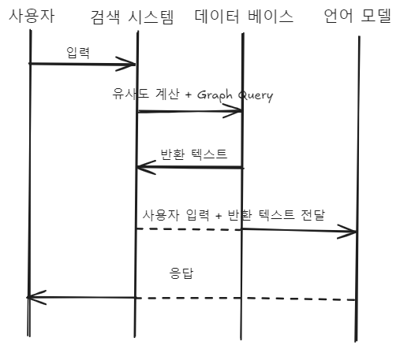

# ServantChatbot
---

---

## Description

초급 공무원의 이탈 ([공무원 이탈, 국가 경쟁력 위기다| 출처 : 아시아경제](https://www.asiae.co.kr/article/2024102907500460587'))은 현재 사회적인 문제가 될 정도로 심각한 사안입니다. 이 때 초급 공무원의 이탈 사유(["공무원 탈출은 지능 순이라고?" 저연차 공무원들이 말하는 '우리가 떠나는 이유' 출처 : SBS 뉴스](https://news.sbs.co.kr/news/endPage.do?news_id=N1007642610))로 열악한 대우와 함께 인수인계 및 업무 전문성을 보조할 프로토콜과 체계가 부재함을 꼽았습니다.

따라서 문제를 해결하기 위해, 법률 및 조례 검색 시스템과 함께 민원 초안을 작성할 Servant-chatbot 프로젝트를 시작하게 되었습니다.

## 프로젝트 구조

- 학습을 병행하여 프로젝트를 진행하려고 하였으나, 현재 자원의 부족과 빠른 POC를 우선하여 일단 배제.

## 프로젝트 서비스 순서도

