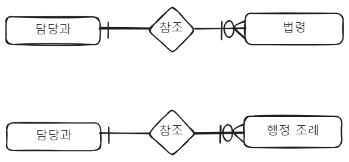

### 담당과 - 법령
---
- 담당과는 대부분 법령을 참조하여 응답을 하는 경우가 있다. 즉, ==민원 -> 배정 -> 담당과 -> 참조 -> 법령==의 순서로 해당 민원에 대한 법령을 참조할 수 있어야 한다. (담당과, 민원 데이터 추출 정보)를 통해 참조해야할 법령에 닿을 수 있어야 함
- 법 자체는 트리 구조로 자체적인 구조를 가지고 있는 매우 체계적인 정보 체계이나, 사실 법령 끼리는 서로 반목하기도 하고 종속 관계도 갖고 있는 매우 복잡한 그래프 정보 체계이다. 법령끼리 참조하기도 하고 서로 상충하는 경우, `특별법` 이나 `상위법` 이 우선하는 체계를 가지고 있다. 도메인을 잘 알아야 만들 수 있을 것 같다.
- 아래의 데이터를 모두 그래프 데이터 화 할 수 있어야 한다.

- 행정법 목록
	- 특별법
		- [행정절차법](https://namu.wiki/w/%ED%96%89%EC%A0%95%EC%A0%88%EC%B0%A8%EB%B2%95 "행정절차법") · [행정대집행법](https://namu.wiki/w/%ED%96%89%EC%A0%95%EB%8C%80%EC%A7%91%ED%96%89%EB%B2%95 "행정대집행법") · 행정규제기본법 · 행정조사기본법 · 국가공무원법 · [경찰관 직무집행법](https://namu.wiki/w/%EA%B2%BD%EC%B0%B0%EA%B4%80%20%EC%A7%81%EB%AC%B4%EC%A7%91%ED%96%89%EB%B2%95 "경찰관 직무집행법") · [공익사업을 위한 토지 등의 취득 및 보상에 관한 법률](https://namu.wiki/w/%EA%B3%B5%EC%9D%B5%EC%82%AC%EC%97%85%EC%9D%84%20%EC%9C%84%ED%95%9C%20%ED%86%A0%EC%A7%80%20%EB%93%B1%EC%9D%98%20%EC%B7%A8%EB%93%9D%20%EB%B0%8F%20%EB%B3%B4%EC%83%81%EC%97%90%20%EA%B4%80%ED%95%9C%20%EB%B2%95%EB%A5%A0 "공익사업을 위한 토지 등의 취득 및 보상에 관한 법률") · 공공기관의 정보공개에 관한 법률 · 부패방지 및 국민권익위원회의 설치와 운영에 관한 법률 · [질서위반행위규제법](https://namu.wiki/w/%EC%A7%88%EC%84%9C%EC%9C%84%EB%B0%98%ED%96%89%EC%9C%84%EA%B7%9C%EC%A0%9C%EB%B2%95 "질서위반행위규제법") · [도로교통법](https://namu.wiki/w/%EB%8F%84%EB%A1%9C%EA%B5%90%ED%86%B5%EB%B2%95 "도로교통법") · [병역법](https://namu.wiki/w/%EB%B3%91%EC%97%AD%EB%B2%95 "병역법") · [식품위생법](https://namu.wiki/w/%EC%8B%9D%ED%92%88%EC%9C%84%EC%83%9D%EB%B2%95 "식품위생법") · [건축법](https://namu.wiki/w/%EA%B1%B4%EC%B6%95%EB%B2%95 "건축법") · **[조세법](https://namu.wiki/w/%EC%84%B8%EB%B2%95 "세법")**([국세기본법](https://namu.wiki/w/%EA%B5%AD%EC%84%B8%EA%B8%B0%EB%B3%B8%EB%B2%95 "국세기본법") · 소득세법 · 법인세법 · 부가가치세법 · 상속세및증여세법 · 지방세법 · 조세특례제한법 · [관세법](https://namu.wiki/w/%EA%B4%80%EC%84%B8%EB%B2%95 "관세법")) · [지방자치법](https://namu.wiki/w/%EC%A7%80%EB%B0%A9%EC%9E%90%EC%B9%98%EB%B2%95 "지방자치법") · [**환경법**](https://namu.wiki/w/%ED%99%98%EA%B2%BD%EB%B2%95 "환경법")(환경정책기본법 · 환경영향평가법 · 대기환경보전법 · 물환경보전법 · [폐기물관리법](https://namu.wiki/w/%ED%8F%90%EA%B8%B0%EB%AC%BC%EA%B4%80%EB%A6%AC%EB%B2%95 "폐기물관리법") · 토양환경보전법 · 자연환경보전법 · 소음-진동관리법 · [환경분쟁 조정법](https://namu.wiki/w/%ED%99%98%EA%B2%BD%EB%B6%84%EC%9F%81%20%EC%A1%B0%EC%A0%95%EB%B2%95 "환경분쟁 조정법"))
	- 행정 기본법
	- 행정 소송법
		- [조문](https://namu.wiki/w/%ED%96%89%EC%A0%95%EC%86%8C%EC%86%A1%EB%B2%95 "행정소송법") · 처분등 · [행정행위](https://namu.wiki/w/%ED%96%89%EC%A0%95%ED%96%89%EC%9C%84 "행정행위")([/종류](https://namu.wiki/w/%ED%96%89%EC%A0%95%ED%96%89%EC%9C%84/%EC%A2%85%EB%A5%98 "행정행위/종류"), [재량하자](https://namu.wiki/w/%EC%9E%AC%EB%9F%89%ED%95%98%EC%9E%90 "재량하자")) · 항고소송([취소소송](https://namu.wiki/w/%EC%B7%A8%EC%86%8C%EC%86%8C%EC%86%A1 "취소소송") · [무효등확인소송](https://namu.wiki/w/%EB%AC%B4%ED%9A%A8%EB%93%B1%ED%99%95%EC%9D%B8%EC%86%8C%EC%86%A1 "무효등확인소송") · 부작위위법확인소송) · [당사자소송](https://namu.wiki/w/%EB%8B%B9%EC%82%AC%EC%9E%90%EC%86%8C%EC%86%A1 "당사자소송") · [집행정지](https://namu.wiki/w/%EC%A7%91%ED%96%89%EC%A0%95%EC%A7%80 "집행정지") ·[당사자심판](https://namu.wiki/w/%EB%8B%B9%EC%82%AC%EC%9E%90%EC%8B%AC%ED%8C%90 "당사자심판")
	- 주요 특별법
		- [국가를 당사자로 하는 소송에 관한 법률](https://namu.wiki/w/%EA%B5%AD%EA%B0%80%EB%A5%BC%20%EB%8B%B9%EC%82%AC%EC%9E%90%EB%A1%9C%20%ED%95%98%EB%8A%94%20%EC%86%8C%EC%86%A1%EC%97%90%20%EA%B4%80%ED%95%9C%20%EB%B2%95%EB%A5%A0 "국가를 당사자로 하는 소송에 관한 법률") · [행정심판법](https://namu.wiki/w/%ED%96%89%EC%A0%95%EC%8B%AC%ED%8C%90%EB%B2%95 "행정심판법") · [국가배상법](https://namu.wiki/w/%EA%B5%AD%EA%B0%80%EB%B0%B0%EC%83%81%EB%B2%95 "국가배상법") · 전자정부법 · 민원처리에 관한 법률
	- 그 외에 민원 각 행정과에서 담당하는 법률
		- 실제 데이터를 수집해야 알 수 있는 법률이 상당히 있을 듯..!

- 그외
	- 행정 일반
		- https://www.law.go.kr/LSW/lsAstSc.do?menuId=391&subMenuId=397&tabMenuId=437&lsFdCd=04,04010000,04010100,04010200,04010300,04010400,04010500,04020000,04030000,04030100,04030200,04030300&eventGubun=060102#AJAX 
	- 공무원 법
		- https://www.law.go.kr/LSW/lsAstSc.do?menuId=391&subMenuId=397&tabMenuId=437&lsFdCd=04,04010000,04010100,04010200,04010300,04010400,04010500,04020000,04030000,04030100,04030200,04030300&eventGubun=060102#AJAX
### 담당과 - 행정 조례
---
- 조례 역시 위와 같음.