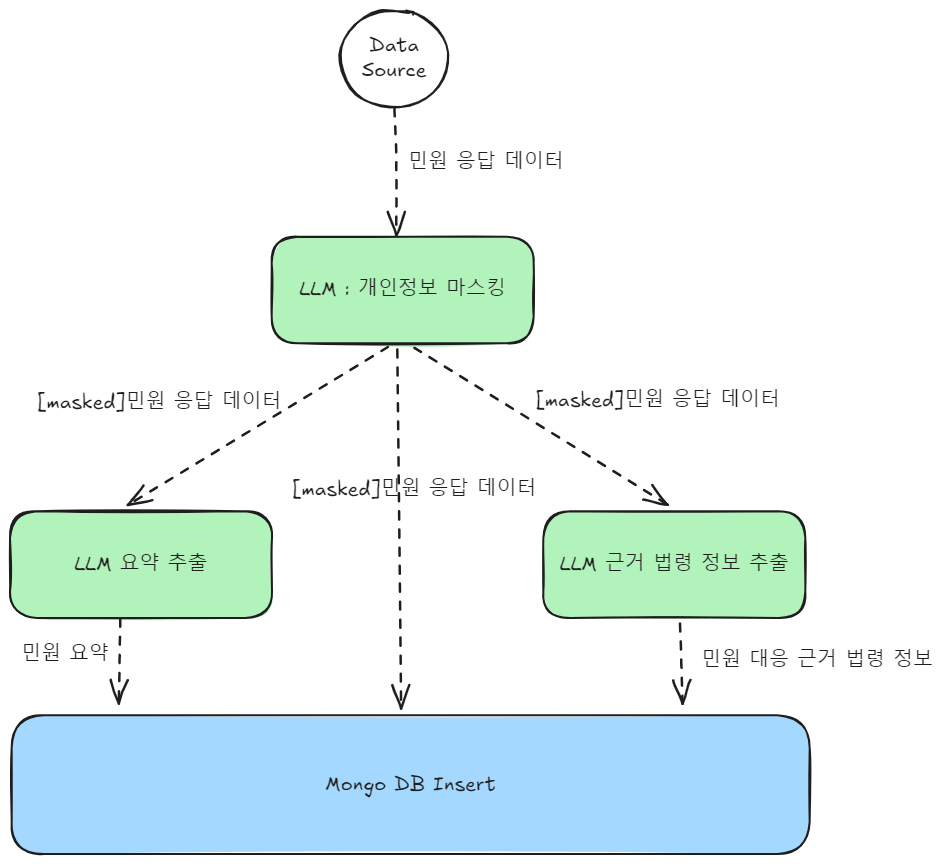

## 민원 응답 데이터 처리
---

- 개인정보 마스킹
	- 민원응답 정보에 해당 정보를 처리하는 담당 공무원의 부서 전화번호와 이름이 있기 때문에, LLM이 불필요하게 해당 정보를 보지 않도록 하고 추후 학습에 활용하기 위해 마스킹 처리를 하도록 함.
- LLM 요약 추출
	- 거의 모든 민원 응답 텍스트에는 민원자의 민원을 간략하게 요약해놓았다. 해당 요약 정보는 추후 요약 모델 학습에 유용하므로, 해당 정보를 추출하여 저장해놓고자 한다.
- LLM 근거 법령 추출
	- 민원 응답에는 민원 응대에 필요한 근거 법령이 기재되어 있는 경우가 있다. 이는 추후 민원 -> 법령을 하기 위한 중요한 정보이므로 따로 추출하여 저장할 수 있도록 한다.