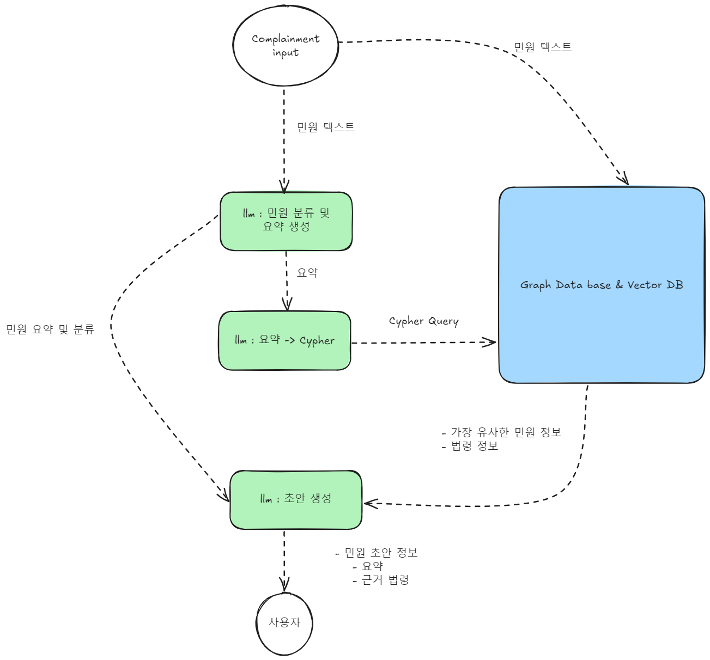

## 민원 초안 생성을 위한 랭그래프 구조도
---
- 민원 분류 및 요약 생성 노드
	- 새로운 민원 정보에 대해 해당 민원을 어디서 처리해야하는지 등의 분류 정보와 요약 정보를 추출한 이후 요약과 분류 정보를 Cypher 쿼리 처리 노드로 넘김
- 요약 -> Cypher 처리 노드
	- 분류와 요약 정보를 받아 Cypher 쿼리 생성
	- 생성한 쿼리를 Graph Database에 질의
- 초안 생성 노드
	- 요약과 분류 정보
	- 가장 유사한 민원 정보
	- 법령 정보
	- 위의 세가지 정보를 기반으로 민원 초안 작성